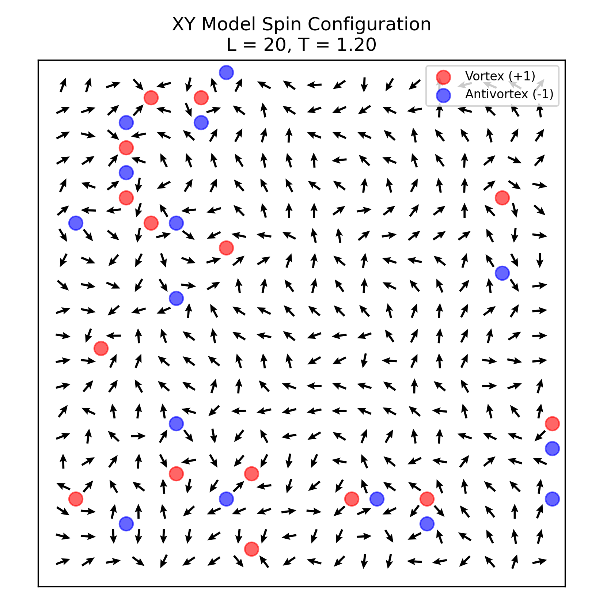
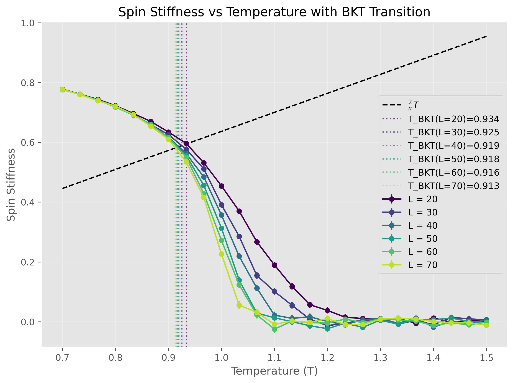
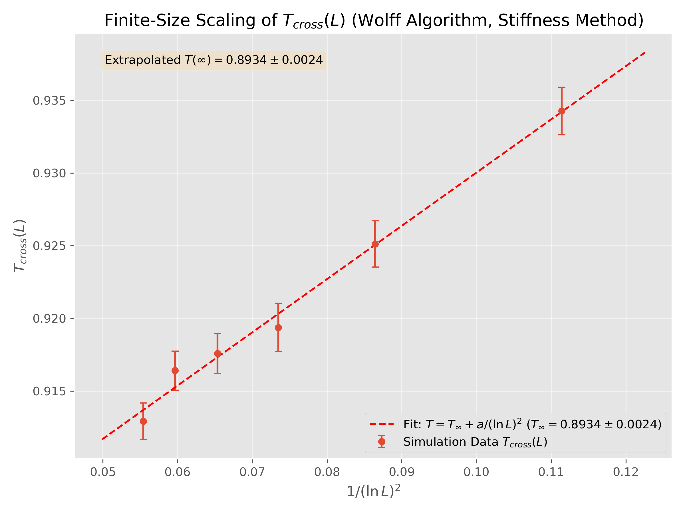

# Fast Implementation of 2D XY Model Simulations

This directory contains Python scripts for simulating the 2D XY model on a square lattice, optimized for performance using Numba and the Wolff cluster algorithm. The primary goal is to study the Berezinskii–Kosterlitz–Thouless (BKT) transition.

## Overview

The code implements Monte Carlo simulations of the classical XY model with Hamiltonian:
```math
H = -J \sum_{\langle i,j \rangle} \cos(\theta_i - \theta_j)
```
It utilizes the efficient Wolff cluster update algorithm, which significantly reduces critical slowing down near the BKT transition temperature compared to local update methods like Metropolis. Numba `@njit` decorators are used to accelerate computationally intensive parts of the simulation and analysis.

## Contents

*   **`simulate.py`**: The main script for running large-scale simulations.
    *   Performs Wolff algorithm sweeps for various system sizes (`L`) and temperatures (`T`).
    *   Calculates key physical observables:
        *   Internal energy
        *   Specific heat
        *   Magnetization (magnitude and components)
        *   Magnetic susceptibility
        *   Helicity modulus (`$\Upsilon$`)
        *   Vortex density
    *   Performs finite-size scaling (FSS) analysis, particularly focusing on the helicity modulus jump and susceptibility divergence to estimate the BKT transition temperature (`$T_{BKT}$`).
    *   Saves raw simulation data (e.g., measurements per sweep) and processed results (e.g., averaged observables, FSS data) to the `xy_model_results/` directory.
    *   Generates plots summarizing the results, including comparisons of observables versus temperature and FSS data collapse plots (e.g., `xy_model_comparison_wolff.png`, `xy_model_fss_wolff.png` - typically found in the output directory).

*   **`visualize.py`**: A script to generate visualizations of typical spin configurations and vortex-antivortex pairs at specific temperatures for a fixed system size (e.g., L=16).
    *   Runs short simulations to obtain equilibrated configurations.
    *   Plots the spin orientations as vectors on the lattice.
    *   Identifies and plots vortices (+1 winding) and antivortices (-1 winding) based on plaquette angle differences.
    *   Saves the output visualization to the `visualization_results/` directory.

## Key Visualizations

1.  **Spin Configurations and Vortices**: Shows the microscopic state of the system at different temperatures, highlighting the proliferation of unbound vortex-antivortex pairs above `$T_{BKT}$`. Generated by `visualize.py`.
    
    *(Example plot - actual content may vary based on run parameters)*

2.  **Observable Comparisons**: Typically plots quantities like helicity modulus, susceptibility, and specific heat against temperature for different system sizes. This illustrates the characteristic signatures of the BKT transition. Generated by `simulate.py`.
    

3.  **Finite-Size Scaling**: Demonstrates the scaling of the crossing temperature `$T_{KT}(L)$` derived from the helicity modulus, confirming BKT scaling theory and allowing for precise estimation of `$T_{KT}(\infty)$`. Generated by `simulate.py`.
    

## Usage

### Running Simulations

Modify parameters (L, temperatures, sweeps, J, etc.) within `simulate.py` as needed.

```bash
python simulate.py
```
Results and plots will be saved in `xy_model_results/`.

### Generating Visualizations

Modify parameters (L_VIS, TEMPERATURES_VIS, etc.) within `visualize.py`.

```bash
python visualize.py
```
The visualization plot will be saved in `visualization_results/`.

## Output Directories

*   **`xy_model_results/`**: Contains raw data (`.npz` or `.npy` files) and analysis plots (`.png` files) generated by `simulate.py`.
*   **`visualization_results/`**: Contains spin configuration plots (`.png` files) generated by `visualize.py`. 